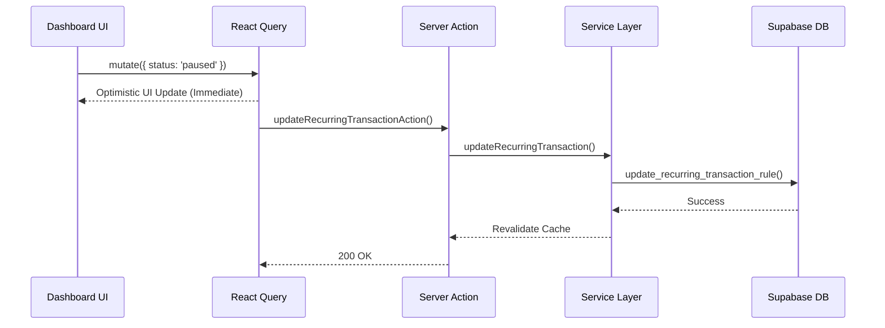

# CashPilot Recurring Transactions Architecture

## Overview
The Recurring Transactions feature allows users to template financial rules (e.g., "Netflix Subscription on the 15th") and automatically generate ledger transactions across time. 

## Component Layers

### 1. Database (`supabase/migrations/`)
- **`recurring_transactions` table**: Stores the user's template rules. Includes standard CRUD fields plus `frequency`, `next_date`, `end_date`, and `status`.
- **Idempotency Constraint**: The `transactions` table has a unique constraint `UNIQUE(user_id, idempotency_key)`. This is the fundamental safety guarantee preventing duplicate executions.

### 2. Processing Engine (`src/services/recurring-engine.service.ts`)
The `RecurringProcessingEngine` is a static, framework-agnostic class. 
- **Time-Travel Execution**: It recursively generates catch-up transactions if a schedule falls behind.
- **Idempotency**: It generates a key format `rec_{rule_id}_{yyyy-MM-dd}` ensuring that concurrent cron jobs cannot duplicate entries.
- **Resilience**: It wraps every rule execution in a `try/catch` and logs localized failures without crashing the batch.

### 3. Service Layer (`src/services/recurring.service.ts`)
- Manages strict Zod parsing before data enters the database.
- Implements partial update merging.
- Wraps the DB queries into explicit `AppError` abstractions (`NotFoundError`, `ValidationError`).

### 4. Server Actions (`src/app/actions/recurring.actions.ts`)
- Implements authentication gating.
- Revalidates Next.js caching paths (`/transactions`, `/dashboard`).

### 5. UI Data Layer (`src/hooks/use-recurring.ts`)
- Utilizes `@tanstack/react-query` to provide optimistic UI updates, ensuring the Dashboard feels instantaneously fast while network requests process in the background.

## Data Flow

