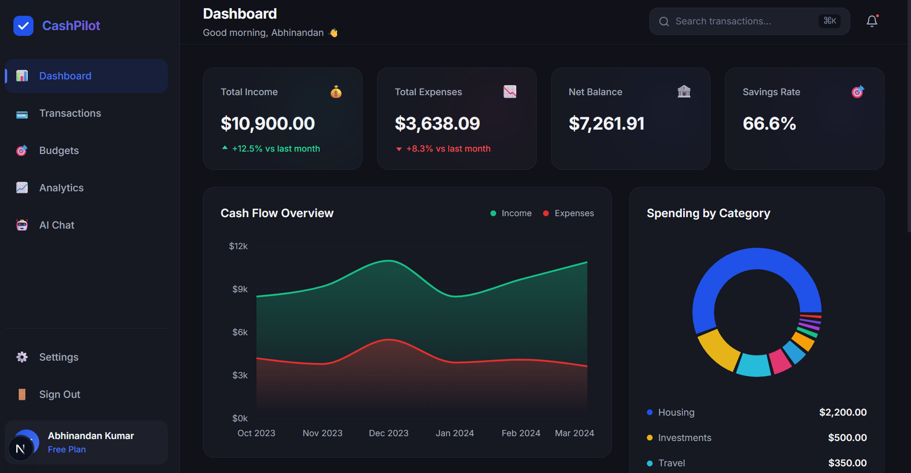
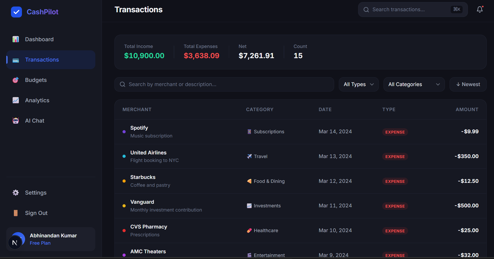

Cashpilot 💸
Full-stack finance tracking app built with Next.js, Supabase, and TypeScript.

🚀 Features
Add / track expenses
Transaction history
User authentication (Supabase)
Clean UI (Next.js)
🛠 Tech Stack
Next.js
Supabase
TypeScript
Tailwind CSS (if using)
## 📸 Screenshots

### 🔐 Authentication

### 📊 Dashboard

### 💳 Transactions

⚠️ Status
🚧 Work in Progress

📌 Future Improvements
AI-based spending insights
Budget prediction
Notifications
⚙️ Setup Instructions
git clone https://github.com/abhi128nandan/Cashpilot.git
cd Cashpilot
npm install
npm run dev
