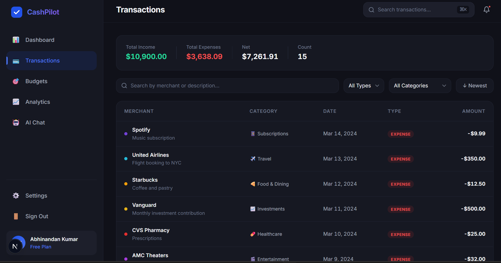

# CashPilot

CashPilot is a full-stack personal finance management platform built with Next.js, TypeScript, and Supabase. It helps users track income and expenses, visualize spending patterns, monitor financial health, and manage personal finances through an intuitive dashboard experience.

## Features

### Financial Management
* Expense tracking
* Transaction history
* Categorization
* Financial overview

### Analytics
* Spending breakdowns
* Income vs expense visualization
* Dashboard metrics

### User Experience
* Authentication
* Responsive design
* Search and filtering

## Technical Highlights
* Next.js App Router architecture
* TypeScript type safety
* Supabase Authentication
* PostgreSQL data persistence
* Dashboard analytics visualizations
* Component-driven UI architecture
* Responsive design system

## System Architecture

```text
User
│
▼
Next.js Frontend
│
├─ Dashboard
├─ Transactions
├─ Analytics
└─ Authentication
│
▼
Supabase
├─ Auth
├─ PostgreSQL
└─ Storage
│
▼
CashPilot Data Layer
```

## Database Architecture

```text
Profiles (Users)
│
├── Transactions
├── Categories
├── Budgets
└── Anomalies

Transactions
│
├── Amount
├── Type
├── Date
└── Category
```

## Challenges Solved
* Secure authentication flow
* Transaction state management
* Financial dashboard aggregation
* Responsive dashboard layouts
* Data visualization integration

## Screenshots

### Authentication
Secure user authentication powered by Supabase.


### Dashboard
Overview of income, expenses, savings rate, and spending analytics.


### Transactions
Searchable transaction management interface.



## Current Status

Completed:
* Authentication
* Dashboard
* Transaction management
* Analytics views

Planned:
* Budget management
* Spending insights
* Financial forecasting

## Key Learnings
* Full-stack application development
* Authentication and authorization
* Database design
* Analytics dashboards
* Responsive UI engineering
* State management

## Prerequisites
- Node 18+
- Supabase project
- OpenAI API key

## Setup
1. Clone the repository
2. Run `npm install`
3. Copy `.env.example` to `.env.local`
4. Fill in the required environment values in `.env.local`
5. Run `npm run dev` to start the development server
