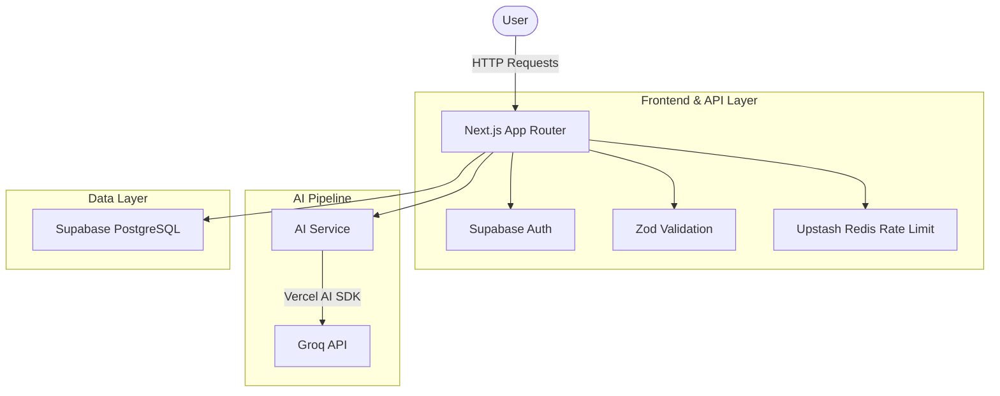

<div align="center">

# 💸 CashPilot

**A modern full-stack personal finance platform built for clarity, control, and production safety.**

[](https://nextjs.org/)
[](https://www.typescriptlang.org/)
[](https://supabase.com/)
[](https://tailwindcss.com/)
[](LICENSE)

[Features](#-features) · [Architecture](#-architecture) · [Getting Started](#-getting-started) · [Deployment Guide](#-deployment-guide) · [Engineering Decisions](#-engineering-decisions) · [Troubleshooting](#-troubleshooting)

</div>

---

## Overview

CashPilot is a comprehensive personal finance application that gives users a complete picture of their financial health. From tracking daily expenses to visualizing income trends and managing budgets — all in one clean, responsive interface powered by AI-assisted insights via Groq.

This project focuses on **production hardening**, featuring Upstash Redis rate limiting, strict Zod environment validation, graceful degradation, and a consolidated AI pipeline.

---

## ✨ Features

- **Transaction Management** — Full searchable and filterable transaction log with duplicate detection
- **Budget Tracking** — Set spending limits and monitor adherence in real time
- **AI Chat Integration (Groq)** — Conversational interface for querying your financial data seamlessly
- **Production-Grade Security** — Rate limiting (Upstash Redis), CSRF protection, and strict input validation (Zod)
- **Secure Authentication** — Email/password auth powered by Supabase

---

## 🏗 Architecture

CashPilot relies on a modern serverless stack, optimizing for speed, safety, and developer experience.


```mermaid
graph TD
    User([User]) -->|HTTP Requests| NextJS[Next.js App Router]
    
    subgraph "Frontend & API Layer"
        NextJS --> Auth[Supabase Auth]
        NextJS --> Validation[Zod Validation]
        NextJS --> RateLimit[Upstash Redis Rate Limit]
    end
    
    subgraph "AI Pipeline"
        NextJS --> AIService[AI Service]
        AIService -->|Vercel AI SDK| Groq[Groq API]
    end
    
    subgraph "Data Layer"
        NextJS --> Supabase[Supabase PostgreSQL]
    end
```

---

## 🚀 Getting Started

### Prerequisites

- [Node.js](https://nodejs.org/) 18+
- A [Supabase](https://supabase.com/) project
- A [Groq](https://groq.com/) API key (for AI chat features)
- An [Upstash](https://upstash.com/) Redis database (for rate limiting)

### Local Setup

```bash
# 1. Clone the repository
git clone https://github.com/abhi128nandan/cashpilot.git
cd cashpilot

# 2. Install dependencies
npm install

# 3. Configure environment variables
cp .env.example .env.local
# Open .env.local and fill in your credentials
```

### Environment Variables

| Variable | Description | Requirement |
|---|---|---|
| `NEXT_PUBLIC_SUPABASE_URL` | Your Supabase project URL | Required |
| `NEXT_PUBLIC_SUPABASE_ANON_KEY` | Your Supabase anon/public key | Required |
| `NEXT_PUBLIC_SITE_URL` | Application URL (default: http://localhost:3000) | Required |
| `GROQ_API_KEY` | Your Groq API key | Required |
| `UPSTASH_REDIS_REST_URL` | Upstash Redis URL | Optional (Rate Limiting) |
| `UPSTASH_REDIS_REST_TOKEN` | Upstash Redis Token | Optional (Rate Limiting) |

Run the app using `npm run dev` and navigate to [http://localhost:3000](http://localhost:3000).

---

## ☁️ Deployment Guide

### Vercel Deployment (Recommended)

1. Import the repository from GitHub into [Vercel](https://vercel.com/)
2. In the Vercel dashboard, configure **all required environment variables**.
3. Deploy! Vercel handles the Next.js serverless functions and edge caching automatically.

### Supabase Setup

1. Create a new project at [supabase.com](https://supabase.com/)
2. Navigate to the **SQL Editor** and run all migration files found in `supabase/migrations/` in order.
3. Enable **Email/Password** authentication under Authentication → Providers.

---

## ⚙️ Engineering Decisions

During the production hardening of CashPilot, several architectural choices were made:

1. **Centralized Zod Validation for Env Vars**: Environment variables are rigorously checked at startup using Zod in `src/lib/env.ts`. This enforces a **fail-fast** principle, preventing cryptic runtime errors during deployment.
2. **Consolidated AI Pipeline**: We migrated away from OpenRouter/Ollama in favor of a single provider—Groq. The `ai.service.ts` encapsulates the AI logic, preventing duplicate configurations and ensuring safe fallback states.
3. **Graceful Degradation**: 
   - If AI credentials are missing, the UI falls back gracefully instead of throwing 500 errors.
   - Rate limiting via Upstash Redis falls back to an in-memory Map implementation if Redis is temporarily unavailable or misconfigured, preserving core application functionality.
4. **Disabling Mock Data in Production**: A hard safety check prevents the use of mock data in the production environment (`process.env.NODE_ENV === 'production'`).

---

## 🛠 Troubleshooting

**"No AI provider configured" error**
- Ensure `GROQ_API_KEY` is present in your `.env.local` and properly loaded.

**"Invalid environment variables" on Startup**
- The application will fail to build or start if mandatory variables in `env.ts` are missing or malformed (e.g., non-URL format for Supabase URL). Check the terminal output for the exact Zod formatting error.

**Rate Limiting Doesn't Seem to Work**
- Confirm that `UPSTASH_REDIS_REST_URL` and `UPSTASH_REDIS_REST_TOKEN` are valid. If they fail, the system falls back to an in-memory store which only tracks IPs per server instance (not distributed).

---

## ⚠️ Known Limitations

1. **In-Memory Rate Limiting Fallback**: While graceful, the fallback rate limiter is instance-specific. If deployed in a serverless environment (like Vercel), this in-memory state does not persist across cold starts. Upstash Redis is strongly recommended for production.
2. **AI Model Constraints**: The Groq LLaMA models are highly performant but context lengths are bounded. Passing massive transaction histories directly into the prompt without summarization might exceed token limits in the future.
3. **No Distributed Locks**: Duplicate transaction prevention relies primarily on standard request flows. Extremely high-concurrency bursts from the same user might require database-level constraints.

---

## 💻 Technical Highlights

- **Next.js App Router** — Leverages React Server Components and Server Actions for optimized data fetching and mutations
- **End-to-end TypeScript** — Full type safety across the entire application stack
- **Supabase Auth** — Secure session management with built-in JWT handling
- **Row Level Security (RLS)** — PostgreSQL-level data isolation ensuring users can only access their own records
- **Complex Analytics Aggregation** — Server-side SQL queries powering the financial metrics dashboard
- **Component-driven Architecture** — Modular, reusable UI components built for maintainability
- **Responsive UI** — Mobile-first design implemented with Tailwind CSS utility classes

---

## 🏷 Suggested Topics

`nextjs` `typescript` `supabase` `postgresql` `personal-finance` `finance-dashboard` `tailwindcss` `full-stack` `vercel-ai-sdk` `openai`

<div align="center">
  Built with ❤️ by <a href="https://github.com/abhi128nandan">abhi128nandan</a>
</div>
