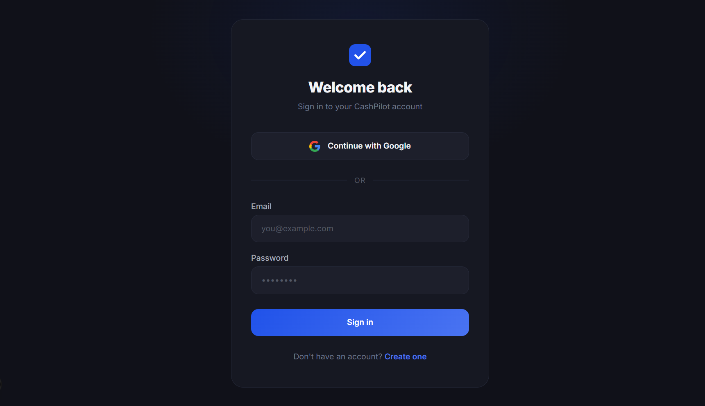
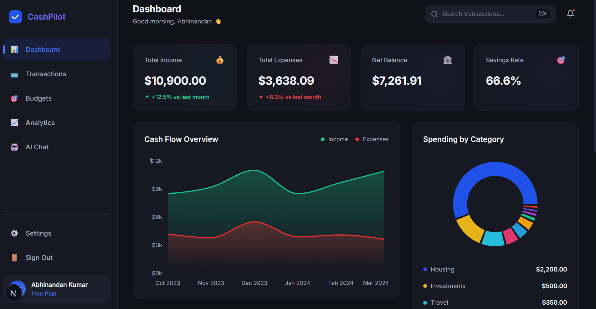

<div align="center">

# 💸 CashPilot

**A modern full-stack personal finance platform built for clarity and control.**

[](https://nextjs.org/)
[](https://www.typescriptlang.org/)
[](https://supabase.com/)
[](https://tailwindcss.com/)
[](LICENSE)

[Features](#-features) · [Tech Stack](#-tech-stack) · [Screenshots](#-screenshots) · [Getting Started](#-getting-started) · [Deployment](#-deployment) · [Roadmap](#-roadmap)

</div>

---

## Overview

CashPilot is a comprehensive personal finance application that gives users a complete picture of their financial health. From tracking daily expenses to visualizing income trends and managing budgets — all in one clean, responsive interface powered by AI-assisted insights.

---

## ✨ Features

### 💳 Financial Management
- **Expense Tracking** — Log and categorize daily transactions with ease
- **Transaction History** — Full searchable and filterable transaction log
- **Budget Tracking** — Set spending limits and monitor adherence in real time
- **Smart Categorization** — Auto-categorize expenses for faster data entry

### 📊 Analytics & Insights
- **Spending Breakdowns** — Visual category-by-category breakdowns of where money goes
- **Income vs. Expense Visualization** — Clear time-series charts for cash flow analysis
- **Financial Metrics Dashboard** — Key financial KPIs surfaced at a glance
- **AI Chat Integration** — Conversational interface for querying your financial data

### 🎨 User Experience
- **Secure Authentication** — Email/password auth powered by Supabase
- **Responsive Design** — Optimized for desktop, tablet, and mobile
- **Search & Filtering** — Fast, flexible transaction lookup
- **Clean UI** — Intuitive dashboard with minimal cognitive overhead

---

## 🛠 Tech Stack

| Layer | Technology |
|---|---|
| Framework | [Next.js](https://nextjs.org/) (App Router) |
| Language | [TypeScript](https://www.typescriptlang.org/) |
| Database & Auth | [Supabase](https://supabase.com/) (PostgreSQL + Auth) |
| Styling | [Tailwind CSS](https://tailwindcss.com/) |
| Validation | [Zod](https://zod.dev/) |
| AI Integration | [Vercel AI SDK](https://sdk.vercel.ai/) |
| Deployment | [Vercel](https://vercel.com/) |

---

## 🏗 Architecture

```
┌─────────────────────────────────────────┐
│              CashPilot User             │
└──────────────────┬──────────────────────┘
                   │
┌──────────────────▼──────────────────────┐
│           Next.js Frontend              │
│  ┌──────────┬──────────┬─────────────┐  │
│  │Dashboard │Transactions│ Analytics  │  │
│  └──────────┴──────────┴─────────────┘  │
│  ┌──────────┬───────────────────────┐   │
│  │  Auth    │     AI Chat           │   │
│  └──────────┴───────────────────────┘   │
└──────────────────┬──────────────────────┘
                   │
┌──────────────────▼──────────────────────┐
│               Supabase                  │
│  ┌──────────┬──────────┬─────────────┐  │
│  │   Auth   │PostgreSQL│   Storage   │  │
│  └──────────┴──────────┴─────────────┘  │
└─────────────────────────────────────────┘
```

---

## 📸 Screenshots

### Authentication



### Dashboard



### Transactions


---

## 🚀 Getting Started

### Prerequisites

- [Node.js](https://nodejs.org/) 18+
- A [Supabase](https://supabase.com/) project
- An [OpenAI](https://platform.openai.com/) API key (for AI chat features)

### Local Setup

```bash
# 1. Clone the repository
git clone https://github.com/abhi128nandan/cashpilot.git
cd cashpilot

# 2. Install dependencies
npm install

# 3. Configure environment variables
cp .env.example .env.local
# Open .env.local and fill in your Supabase and OpenAI credentials

# 4. Start the development server
npm run dev
```

Open [http://localhost:3000](http://localhost:3000) to view the application.

### Environment Variables

| Variable | Description |
|---|---|
| `NEXT_PUBLIC_SUPABASE_URL` | Your Supabase project URL |
| `NEXT_PUBLIC_SUPABASE_ANON_KEY` | Your Supabase anon/public key |
| `OPENAI_API_KEY` | Your OpenAI API key |

Refer to `.env.example` for the full list of required variables.

---

## ☁️ Deployment

### Vercel

1. Import the repository from GitHub into [Vercel](https://vercel.com/)
2. Configure all required environment variables in the Vercel dashboard
3. Deploy — Vercel handles the rest automatically

### Supabase

1. Create a new project at [supabase.com](https://supabase.com/)
2. Navigate to the **SQL Editor** and run all migration files found in `supabase/migrations/` in order
3. Enable **Email/Password** authentication under Authentication → Providers

---

## 📋 Current Status

| Module | Status |
|---|---|
| Authentication | ✅ Complete |
| Dashboard | ✅ Complete |
| Transaction Management | ✅ Complete |
| Analytics Views | ✅ Complete |
| Budget Management | ✅ Complete |
| AI Chat Integration | ✅ Complete |

---

## 🗺 Roadmap

- [ ] Advanced spending insights with anomaly detection
- [ ] Financial forecasting models
- [ ] [Plaid](https://plaid.com/) integration for automatic bank syncing
- [ ] Recurring transaction detection
- [ ] Export to CSV / PDF

---

## ⚙️ Engineering Highlights

- **Next.js App Router** — Leverages React Server Components and Server Actions for optimized data fetching and mutations
- **End-to-end TypeScript** — Full type safety across the entire application stack
- **Supabase Auth** — Secure session management with built-in JWT handling
- **Row Level Security (RLS)** — PostgreSQL-level data isolation ensuring users can only access their own records
- **Complex Analytics Aggregation** — Server-side SQL queries powering the financial metrics dashboard
- **Component-driven Architecture** — Modular, reusable UI components built for maintainability
- **Responsive UI** — Mobile-first design implemented with Tailwind CSS utility classes

---

## 🏷 Suggested Topics

`nextjs` `typescript` `supabase` `postgresql` `personal-finance` `finance-dashboard` `tailwindcss` `full-stack` `vercel-ai-sdk` `openai`

---

## 📄 License

This project is licensed under the [MIT License](LICENSE).

---

<div align="center">
  Built with ❤️ by <a href="https://github.com/abhi128nandan">abhi128nandan</a>
</div>
