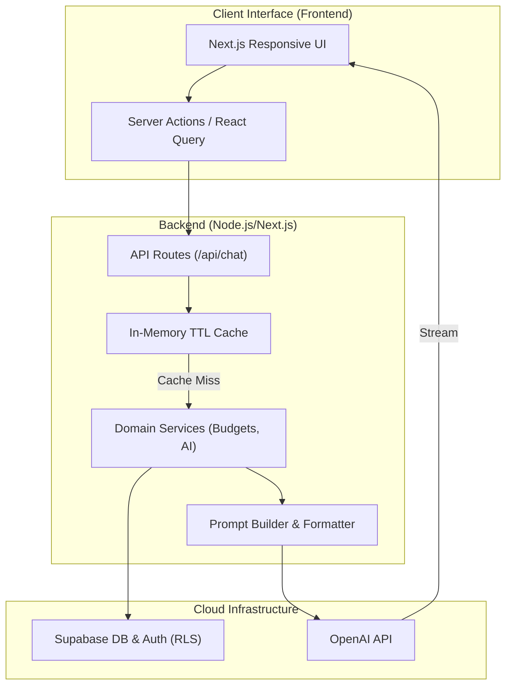

<div align="center">

# 💸 CashPilot

**A high-performance, containerized personal finance manager built with Next.js, TypeScript, Supabase, and AI.**

[](https://github.com/abhi128nandan/cashpilot/actions)
[](https://nextjs.org/)
[](https://www.typescriptlang.org/)
[](https://www.docker.com/)
[](https://supabase.com/)

[Live Demo](#-live-demo) • [Key Features](#-key-features) • [Tech Stack](#-tech-stack) • [AI System](#-ai-system) • [Architecture](#%EF%B8%8F-architecture) • [Getting Started](#%EF%B8%8F-getting-started) • [Deployment](#-deployment)

</div>

---

## 📑 Table of Contents

- [Project Overview](#-project-overview)
- [Live Demo](#-live-demo)
- [Key Features](#-key-features)
- [AI System](#-ai-system)
- [Performance Optimizations](#-performance-optimizations)
- [Security](#-security)
- [Responsive Design](#-responsive-design)
- [Tech Stack](#-tech-stack)
- [Architecture](#%EF%B8%8F-architecture)
- [Project Directory Layout](#-project-directory-layout)
- [Getting Started](#%EF%B8%8F-getting-started)
  - [Environment Variables](#environment-variables)
  - [Database Setup (Supabase)](#database-setup-supabase)
  - [Running Locally](#running-locally)
- [Testing](#-testing)
- [Deployment](#-deployment)
  - [Docker Deployment](#docker-deployment)
  - [Environment Matrix](#environment-matrix)
- [API Reference](#-api-reference)
- [Roadmap](#%EF%B8%8F-roadmap)
- [Developer Operations](#-developer-operations)
- [Contributing](#-contributing)
- [License](#-license)

---

## 📖 Project Overview

**CashPilot** is a production-ready, intelligent personal finance manager designed to give users absolute control over their financial health. 

* **The Problem:** Modern financial tools are often bloated, slow, and lack actionable, contextual insights. Users struggle to track subscriptions and manage dynamic budgets without manual spreadsheet labor.
* **The Solution:** CashPilot provides a lightning-fast, highly secure dashboard that automates ledger tracking, warns about budget overruns, identifies recurring subscriptions, and offers an integrated AI financial assistant for personalized analysis.
* **Target Users:** Individuals seeking proactive budget management, subscription tracking, and intelligent, private financial insights.
* **Key Capabilities:** Real-time ledger, deterministic AI context caching, responsive charts, automated anomaly detection, and row-level secured data isolation.

---

## 🌐 Live Demo

> **Production URL:** [https://cashpilot.example.com](https://cashpilot.example.com) *(Insert your live URL here)*

*Demo credentials (if applicable) can be found on the landing page.*

---

## 🚀 Key Features

### Authentication
* Secure JWT-based authentication powered by Supabase.
* Email/Password login with protected API routes.

### Transactions
* Add and manage transactions (incomes, expenses, transfers).
* Precise timestamp sorting (newest/oldest sorting down to the second).
* Integrated text search matching merchants and descriptions.

### Budgets
* Set custom spending thresholds across categories.
* Live utilization trackers with color-coded alerts (Good/Warning/Danger).
* Dynamic summary metrics indicating total surplus or budget overruns in real time.

### Analytics
* Dynamic month-based list filtering populated chronologically.
* Automated anomaly detection for unusual spending patterns.

### Recurring Transactions
* Automatic detection of recurring transactions.
* Early payment warnings for upcoming subscriptions.
* Built-in execution engine preventing duplicate billing.

### AI Assistant
* Natural language querying of live financial data.
* Proactive financial coaching powered by OpenAI.

### Dashboard
* Highly visual, card-based overview of financial health.
* Responsive charts rendering spending trends.

### Performance
* Server Actions and optimistic UI updates for instant feedback.
* In-memory session context caching.

### Security
* Strict Row-Level Security (RLS) ensuring isolated account sessions.
* Comprehensive input schema validation via Zod.

### Responsive Design
* Mobile-first architecture supporting all screen sizes.

### Testing
* Comprehensive unit and integration test coverage via Vitest.

---

## 🧠 AI System

CashPilot features a highly optimized, decoupled AI architecture designed for low latency and high context accuracy.

* **Prompt Builder:** Deterministically compiles JSON data into a strictly formatted Markdown system prompt.
* **Context Service:** Aggregates transactions, budgets, recurring liabilities, and anomalies into a single `AIContextData` object.
* **Streaming:** Utilizes the Vercel AI SDK for ultra-low latency token streaming directly to the client UI.
* **Caching:** Implements a Lambda-scoped, TTL-based `AIContextCache` to prevent redundant database aggregation during multi-turn chats.
* **Conversation History:** Cleanly decoupled from financial context to optimize tokens.
* **Context Injection:** Injects live data directly into the system prompt, preventing hallucinations.
* **Security & Isolation:** Prompt generation is securely gated behind `requireAuth()`. AI only sees RLS-filtered user data.
* **Token Optimization:** Slashes token usage by pre-aggregating metrics mathematically before sending them to the LLM.

---

## ⚡ Performance Optimizations

* **React Query:** Manages client-side cache, deduping requests, and handling optimistic UI mutations.
* **Caching:** Dual-layer caching utilizing `ttlCache` for database queries and `aiSessionCache` for LLM contexts.
* **Streaming:** Next.js UI streaming and React Suspense boundaries prevent render-blocking.
* **Lazy Loading:** Heavy UI components are dynamically imported.
* **Parallel Fetching:** Data aggregation utilizes `Promise.all` to fetch analytical, budget, and ledger data concurrently.

---

## 🛡️ Security

* **Authentication & Authorization:** Hardened `requireAuth()` guards on all Server Actions and API endpoints.
* **Supabase RLS:** Every database query executes under the user's secure Postgres role. Cross-user data leakage is physically impossible.
* **Input Validation:** Zod schemas sanitize all incoming payloads before processing.
* **AI Isolation:** Prompt Injection is mitigated by strictly formatting numerical JSON data inside the system prompt and enforcing adherence to facts.
* **Session Handling:** Secure, HttpOnly JWT cookies.

---

## 📱 Responsive Design

CashPilot provides a flawless experience across all devices.

* **Desktop:** Maximized widescreen utilization, complex charts, and sidebar navigation.
* **Tablet (768px):** Adaptive grid layouts and collapsable UI components.
* **Mobile (320px):** Bottom navigation, touch-friendly targets, adaptive tables with `overflow-x: auto`, and vertically stacked cards.

---

## 🧰 Tech Stack

| Domain | Technology |
| :--- | :--- |
| **Frontend** | React 19, Next.js 16.2 (App Router), Vanilla CSS Modules |
| **Backend** | Next.js Server Actions, API Routes, Node.js 20+ |
| **Database** | PostgreSQL, Supabase (with Row Level Security) |
| **Authentication** | Supabase Auth (JWT) |
| **Caching** | React Query, Next.js Unstable Cache, In-Memory TTL |
| **AI** | OpenAI (`gpt-4o-mini`), Vercel AI SDK |
| **Deployment** | Docker, Vercel |
| **Testing** | Vitest, ESLint, TypeScript |

---

## 🕹️ Architecture

The request lifecycle is cleanly tiered, ensuring high maintainability and isolation of concerns:


```mermaid
graph TD
    subgraph Client ["Client Interface (Frontend)"]
        UI["Next.js Responsive UI"]
        Forms["Server Actions / React Query"]
    end

    subgraph Server ["Backend (Node.js/Next.js)"]
        API["API Routes (/api/chat)"]
        Services["Domain Services (Budgets, AI)"]
        Builder["Prompt Builder & Formatter"]
        Cache["In-Memory TTL Cache"]
    end

    subgraph Cloud ["Cloud Infrastructure"]
        Supabase["Supabase DB & Auth (RLS)"]
        OpenAI["OpenAI API"]
    end

    UI --> Forms
    Forms --> API
    API --> Cache
    Cache -- Cache Miss --> Services
    Services --> Supabase
    Services --> Builder
    Builder --> OpenAI
    OpenAI -- Stream --> UI
```

---

## 📂 Project Directory Layout

```
├── .github/             # GitHub Actions CI/CD workflows
├── supabase/            # Supabase database config & SQL migrations
├── src/                 # Application source code
│   ├── app/             # Next.js App Router (Pages, Layouts & API routes)
│   ├── components/      # UI components (Features & global layouts)
│   │   ├── features/    # Page-specific features (Transactions, Budgets, AI)
│   │   └── layout/      # Shared layout elements (Sidebar, Header)
│   ├── hooks/           # Custom React hooks (useTransactions, useBudgets)
│   ├── lib/             # Database clients, caching utilities, AI formatters
│   │   ├── ai/          # Prompt Builder & AI Formatter
│   │   ├── cache/       # AI Session Context Cache
│   │   ├── db/          # Core queries & DB config
│   │   └── utils/       # Shared utility scripts
│   ├── services/        # Domain business logic (Transactions, AI Context)
│   └── types/           # Global TypeScript type definitions
├── Dockerfile           # Multi-stage production container build schema
└── docker-compose.yml   # Multi-service local orchestrator configuration
```

---

## 🛠️ Getting Started

### Prerequisites
*   Node.js v20.9.0 or newer
*   npm v10+
*   A free Supabase account

### Environment Variables
Duplicate `.env.example` as `.env.local` and populate the fields. **Never expose these secrets in client code.**

```env
# URL for your Supabase PostgreSQL instance
NEXT_PUBLIC_SUPABASE_URL=https://your-project.supabase.co

# Public anon key for Supabase Auth
NEXT_PUBLIC_SUPABASE_ANON_KEY=your-anon-key

# OpenAI Secret API Key (Server-side only)
OPENAI_API_KEY=sk-your-openai-key
```

### Database Setup (Supabase)
1.  Create a project at [supabase.com](https://supabase.com/).
2.  Navigate to the **SQL Editor** in your Supabase dashboard.
3.  Open, copy, and run the SQL migration scripts located in the `supabase/migrations/` folder in sequence to build your schema and RLS policies.
4.  Navigate to **Authentication -> Providers** and verify that the **Email/Password** provider is enabled.

### Running Locally
Run the following commands to initialize and start the application:

```bash
# 1. Clone repository
git clone https://github.com/abhi128nandan/cashpilot.git
cd cashpilot

# 2. Install dependencies
npm install

# 3. Start development server (Fast Refresh)
npm run dev

# 4. Run tests
npm run test

# 5. Typecheck & Lint
npm run typecheck
npm run lint

# 6. Build for production
npm run build
```
Access the app locally at `http://localhost:3000`.

---

## 🧪 Testing

CashPilot utilizes **Vitest** for blistering fast execution.

*   **Unit Tests:** Full coverage over pure functions, AI Prompt Builders, formatters, and utility scripts.
*   **Integration Tests:** Service-layer mocking tests for Supabase interactions and Caching modules.
*   **Commands:**
    *   `npm run test` (Run test suite)
    *   `npm run test:watch` (Run in watch mode)

---

## 🐳 Deployment

### Docker Deployment
CashPilot includes a multi-stage production Docker environment for self-hosting.

1.  Copy your environment configuration:
    ```bash
    cp .env.local .env
    ```
2.  Deploy the container in detached mode:
    ```bash
    docker-compose up -d --build
    ```
    Access the production application at 👉 **`http://localhost:3001`**.

### Environment Matrix

| Parameter / Feature | Local Development | Production Docker |
| :--- | :--- | :--- |
| **Command** | `npm run dev` | `docker-compose up -d --build` |
| **Port** | `3000` | `3001` |
| **Hot Reloading** | Enabled | Disabled |
| **Minification** | Disabled | Enabled (Standalone build) |
| **Security Headers** | Basic | Complete (Strict-Transport-Security) |

---

## 🛣️ API Reference

### 1. Transactions API (`/api/transactions`)
*   **`GET`** — Retrieve all transactions for the authenticated user session.
*   **`POST`** — Add a transaction entry.
*   **`DELETE`** — Remove a transaction entry `?id={transactionId}`.

### 2. Budgets API (`/api/budgets`)
*   **`GET`** — Fetch category budgets.
*   **`POST`** — Create/override budget limits.

### 3. AI Chat API (`/api/chat`)
*   **`POST`** — Secure, streaming LLM interaction. Requires valid user session. Handles deterministic caching and conversation history extraction natively.

---

## 🗺️ Roadmap

The following features are slated for future development:
- [ ] **Financial Goals** — Save towards specific milestones (e.g., Vacation, Emergency Fund).
- [ ] **Financial Health Score** — Aggregate metrics into a single FICO-style health score.
- [ ] **AI Financial Coach** — Proactive, push-based notifications for saving opportunities.
- [ ] **Monthly Reports** — Automated PDF email generation.
- [ ] **Export Features** — Export ledger to CSV, QIF, and OFX.
- [ ] **Notifications** — SMS and Push notification integration for budget limits.

*(Note: Items marked with `[ ]` are future features and not yet implemented.)*

---

## 🤝 Contributing

We welcome contributions! Please follow these guidelines:
1.  Fork the repository and create your feature branch: `git checkout -b feature/amazing-feature`.
2.  Ensure that your code is strictly typed and passes local builds: `npm run build && npm run test`.
3.  Commit your alterations with a clean commit description: `git commit -m "feat: add amazing feature"`.
4.  Push your branch to GitHub and create a Pull Request against `main`.

---

## 🧑‍💻 Developer Operations

### Pushing Code Updates to GitHub
```bash
git add .
git commit -m "feat: update transactions view and Docker config"
git push origin main
```

### Checking Container Health and Logs
*   **View active containers:** `docker ps`
*   **Monitor live logs:** `docker logs -f next_js_project-web-1`
*   **Verify response status:** `curl -I http://localhost:3001`

---

## 📄 License

This project is licensed under the [MIT License](LICENSE) — see the LICENSE file for details.

---

<div align="center">
  Built with ❤️ by <a href="https://github.com/abhi128nandan">abhi128nandan</a>
</div>
