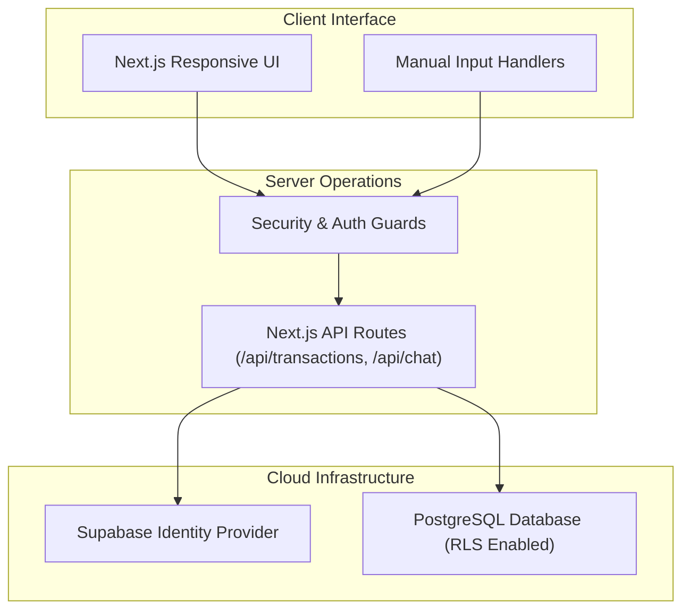

<div align="center">

# 💸 CashPilot

**A high-performance, containerized personal finance manager built with Next.js, TypeScript, and Supabase.**

[](https://github.com/abhi128nandan/cashpilot/actions)
[](https://nextjs.org/)
[](https://www.typescriptlang.org/)
[](https://www.docker.com/)
[](https://supabase.com/)

[Key Features](#-key-features) • [Tech Stack](#-tech-stack) • [Architecture](#%EF%B8%8F-architecture) • [Project Directory Layout](#-project-directory-layout) • [Environment Matrix](#-environment-matrix) • [Roadmap](#%EF%B8%8F-roadmap) • [Local Installation](#%EF%B8%8F-local-installation) • [Docker Deployment](#-docker-deployment) • [Developer Operations](#-developer-operations) • [API Reference](#-api-reference)

</div>

---

## 🚀 Key Features

*   **💳 Transaction Hub**
    *   Add and manage transactions (incomes, expenses, transfers).
    *   Dynamic month-based list filtering populated chronologically from records.
    *   Precise timestamp sorting (newest/oldest sorting down to the second).
    *   Integrated text search matching merchants and descriptions.
*   **📊 Budget Center**
    *   Set custom spending thresholds across categories.
    *   Live utilization trackers with color-coded alerts (Good/Warning/Danger).
    *   Dynamic summary metrics indicating total surplus or budget overruns in real time.
*   **🛡️ Security & Integrity**
    *   Strict row-level database security (RLS) ensuring isolated account sessions.
    *   Input payload and schema validation via Zod.
    *   Optimized security response headers configured out of the box.

---

## 🧰 Tech Stack

*   **Core Framework:** [Next.js 16.2 (App Router)](https://nextjs.org/)
*   **Language:** [TypeScript](https://www.typescriptlang.org/)
*   **Styling:** Vanilla CSS (CSS Modules)
*   **State & Data Hooks:** React 19 State, Hooks, and Server Actions
*   **Database & Authentication:** [Supabase](https://supabase.com/) (PostgreSQL with RLS)
*   **DevOps & Deployment:** Docker, Docker Compose, GitHub Actions CI
*   **Data Validation:** [Zod](https://zod.dev/)

---

## 🕹️ Architecture

The flow of requests and data in CashPilot is illustrated in the diagram below:


```mermaid
graph TD
    subgraph Client ["Client Interface"]
        UI["Next.js Responsive UI"]
        Forms["Manual Input Handlers"]
    end

    subgraph Server ["Server Operations"]
        API["Next.js API Routes (/api/transactions, /api/chat)"]
        Middleware["Security & Auth Guards"]
    end

    subgraph DB ["Cloud Infrastructure"]
        SupabaseAuth["Supabase Identity Provider"]
        Postgres["PostgreSQL Database (RLS Enabled)"]
    end

    UI --> Middleware
    Forms --> Middleware
    Middleware --> API
    API --> SupabaseAuth
    API --> Postgres
```

---

## 📂 Project Directory Layout

```
├── .github/             # GitHub Actions CI/CD workflows
├── supabase/            # Supabase database config & SQL migrations
├── src/                 # Application source code
│   ├── app/             # Next.js App Router (Pages, Layouts & API routes)
│   ├── components/      # UI components (Features & global layouts)
│   │   ├── features/    # Page-specific features (Transactions, Budgets)
│   │   └── layout/      # Shared layout elements (Sidebar, Header)
│   ├── hooks/           # Custom React hooks (useTransactions, useBudgets)
│   ├── lib/             # Database connection clients, validators & formats
│   │   ├── db/          # Core queries & DB config
│   │   └── utils/       # Formatter scripts (Currency, Date formatters)
│   ├── services/        # Client-side API query services
│   └── types/           # Global TypeScript type definitions
├── Dockerfile           # Multi-stage production container build schema
└── docker-compose.yml   # Multi-service local orchestrator configuration
```

---

## 📊 Environment Matrix

| Parameter / Feature | Local Development Mode | Production Docker Mode |
| :--- | :--- | :--- |
| **Command** | `npm run dev` | `docker-compose up -d --build` |
| **Port** | `3000` | `3001` |
| **Hot Reloading** | Enabled (Fast Refresh) | Disabled (Optimized static runtime) |
| **Minification** | Disabled | Enabled (Next.js standalone build) |
| **Security Headers** | Basic | Complete (including Strict-Transport-Security) |

---

## 🛣️ Roadmap

- [x] **Phase 1: Core Ledger & Budgets** — Manual transaction inputs, category badges, dynamic limits.
- [x] **Phase 2: UX Hardening** — Precise timestamp sorting, monthly dropdown filters, visual transfer indicators, clear filter CTA.
- [ ] **Phase 3: Automated Syncing** — Integrate Plaid Link API for automatic credit and banking syncs.
- [ ] **Phase 4: Subscriptions Tracker** — Automatic detection of recurring transactions with early payment warnings.
- [ ] **Phase 5: Exports & Reports** — Add CSV/PDF statements compilation.

---

## 🛠️ Local Installation

### Prerequisites
*   Node.js v20 or newer
*   npm v10+

### Step-by-Step Setup
1.  **Clone the Repository:**
    ```bash
    git clone https://github.com/abhi128nandan/cashpilot.git
    cd cashpilot
    ```

2.  **Install Dependencies:**
    ```bash
    npm install
    ```

3.  **Configure Environment Variables:**
    Duplicate `.env.example` as `.env.local`:
    ```bash
    cp .env.example .env.local
    ```
    Populate the variables with your Supabase credentials:
    ```env
    NEXT_PUBLIC_SUPABASE_URL=https://your-project.supabase.co
    NEXT_PUBLIC_SUPABASE_ANON_KEY=your-anon-key
    ```

4.  **Run Development Server:**
    ```bash
    npm run dev
    ```
    Access the app locally at `http://localhost:3000`.

---

## 🐳 Docker Deployment

CashPilot includes a multi-stage production Docker environment for self-hosting.

### 1. Configure the Docker Environment File
Docker compose requires a `.env` file in the root directory. Copy your environment configuration:
```bash
cp .env.local .env
```

### 2. Run the App
Deploy the container in detached mode:
```bash
docker-compose up -d --build
```
Access the production application at 👉 **`http://localhost:3001`**.

---

## 📁 Database Setup (Supabase)

1.  Create a project at [supabase.com](https://supabase.com/).
2.  Navigate to the **SQL Editor** in your Supabase dashboard.
3.  Open, copy, and run the SQL migration scripts located in the `supabase/migrations/` folder in sequence.
4.  Navigate to **Authentication -> Providers** and verify that the **Email/Password** provider is enabled.

---

## 🛣️ API Reference

### 1. Transactions API (`/api/transactions`)

*   **`GET`** — Retrieve all transactions for the authenticated user session.
*   **`POST`** — Add a transaction entry.
    *   *Payload:*
        ```json
        {
          "amount": 2500.50,
          "type": "expense",
          "categoryId": "uuid-here",
          "merchant": "Amazon",
          "description": "Office supply items",
          "transactionDate": "2026-07-02"
        }
        ```
*   **`DELETE`** — Remove a transaction entry.
    *   *Parameters:* Query string `?id={transactionId}`.

### 2. Budgets API (`/api/budgets`)

*   **`GET`** — Fetch category budgets.
*   **`POST`** — Create/override budget limits.

---

## 🤝 Contributing Guidelines

We welcome contributions! Please follow these guidelines:
1.  Fork the repository and create your feature branch: `git checkout -b feature/amazing-feature`.
2.  Ensure that your code is strictly typed and passes local builds: `npm run build`.
3.  Commit your alterations with a clean commit description: `git commit -m "Add amazing feature"`.
4.  Push your branch to GitHub and create a Pull Request against `main`.

---

## 🧑‍💻 Developer Operations

### Pushing Code Updates to GitHub
Run the following commands in your project root terminal to commit and push your changes to your remote repository:

```bash
# 1. Stage all changes
git add .

# 2. Commit changes with a descriptive message
git commit -m "Update transactions view, monthly filter, and Docker configuration"

# 3. Push to GitHub main branch
git push origin main
```

### Checking Container Health and Logs
If you run into issues running Docker, use these monitoring utilities:

*   **View active containers and port mappings:**
    ```bash
    docker ps
    ```
*   **Monitor live logs from the web service container:**
    ```bash
    docker logs -f next_js_project-web-1
    ```
*   **Verify response status via CLI (Health Check):**
    ```bash
    curl -I http://localhost:3001
    ```

---

## 📄 License

This project is licensed under the [MIT License](LICENSE) — see the LICENSE file for details.

---

<div align="center">
  Built with ❤️ by <a href="https://github.com/abhi128nandan">abhi128nandan</a>
</div>
