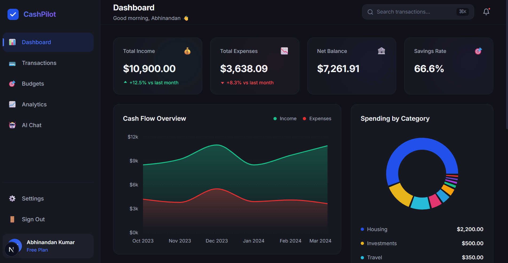
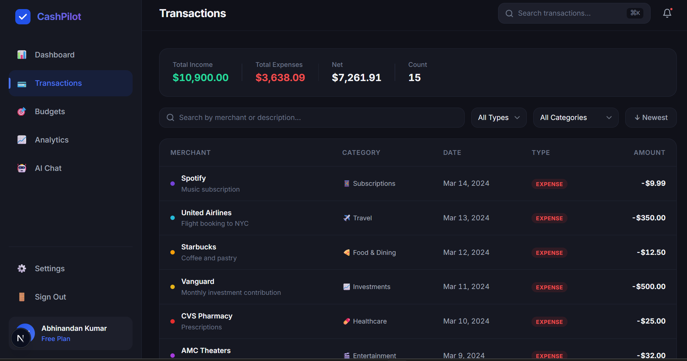
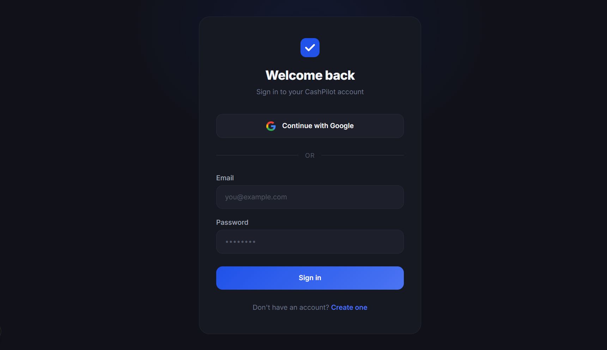
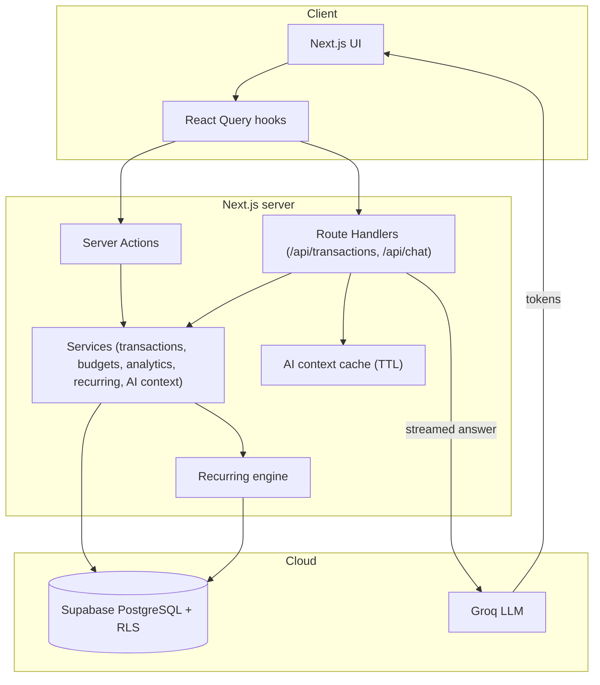

<div align="center">

# 💸 CashPilot

**An AI-powered personal finance manager: track spending, set budgets, automate recurring bills and ask questions about your money in plain English.**

[](https://github.com/abhi128nandan/Cashpilot/actions/workflows/ci.yml)
[](https://nextjs.org/)
[](https://www.typescriptlang.org/)
[](https://supabase.com/)
[](#-docker)
[](LICENSE)

### 🚀 [Live Demo → YOUR_LIVE_URL](YOUR_LIVE_URL)



</div>

---

## 📑 Table of Contents

- [Features](#-features)
- [Screenshots](#-screenshots)
- [Tech Stack](#-tech-stack)
- [Architecture](#-architecture)
- [How the AI assistant works](#-how-the-ai-assistant-works)
- [Engineering highlights](#-engineering-highlights)
- [Getting Started](#-getting-started)
- [Testing & CI](#-testing--ci)
- [Docker](#-docker)
- [API Reference](#-api-reference)
- [Known limitations](#-known-limitations)
- [Roadmap](#-roadmap)
- [License](#-license)

---

## ✨ Features

| Area | What you can do |
| :--- | :--- |
| **Authentication** | Email/password sign-up and login via Supabase Auth, with protected routes and API endpoints |
| **Transactions** | Add, filter, search, sort and delete income, expense and transfer entries |
| **Budgets** | Set per-category limits and track usage with colour-coded Good / Warning / Danger states |
| **Analytics** | Monthly cash-flow chart, spending-by-category breakdown and automatic anomaly alerts |
| **Recurring transactions** | Create daily / weekly / monthly / yearly rules that generate transactions automatically; pause, resume or archive them |
| **AI assistant** | Ask questions such as *"Where did I spend the most last month?"* and get streamed answers based on your own data |
| **Responsive UI** | Works on desktop, tablet and mobile |

---

## 🖼️ Screenshots

| Dashboard | Transactions | Sign in |
| :---: | :---: | :---: |
|  |  |  |

---

## 🧰 Tech Stack

| Layer | Technology |
| :--- | :--- |
| **Frontend** | React 19, Next.js 16 (App Router), TypeScript, CSS Modules + Tailwind CSS, Recharts |
| **Backend** | Next.js Server Actions and Route Handlers, Zod validation |
| **Database & Auth** | Supabase (PostgreSQL, Row Level Security, Supabase Auth) |
| **State / data fetching** | TanStack React Query (with optimistic updates) |
| **AI** | Vercel AI SDK + Groq (`llama-3.1-8b-instant`), streaming responses |
| **Testing & tooling** | Vitest, Testing Library, ESLint, GitHub Actions |
| **Deployment** | Vercel or Docker |

---

## 🕹️ Architecture

The code is split into layers so that UI, business logic and data access stay independent:

```
UI components → React Query hooks → Server Actions / Route Handlers → Services → Supabase (RLS)
```


```mermaid
graph TD
    subgraph Client
        UI["Next.js UI"]
        RQ["React Query hooks"]
    end

    subgraph Server["Next.js server"]
        SA["Server Actions"]
        API["Route Handlers (/api/transactions, /api/chat)"]
        SVC["Services (transactions, budgets, analytics, recurring, AI context)"]
        ENG["Recurring engine"]
        CACHE["AI context cache (TTL)"]
    end

    subgraph Cloud
        DB[("Supabase PostgreSQL + RLS")]
        LLM["Groq LLM"]
    end

    UI --> RQ
    RQ --> SA
    RQ --> API
    SA --> SVC
    API --> SVC
    SVC --> DB
    SVC --> ENG
    ENG --> DB
    API --> CACHE
    API -- "streamed answer" --> LLM
    LLM -- "tokens" --> UI
```

More detail on the recurring-transactions design is in [ARCHITECTURE.md](ARCHITECTURE.md).

<details>
<summary><b>Project layout</b></summary>

```
├── .github/workflows/ci.yml   # lint, typecheck, test, build
├── supabase/migrations/       # SQL schema, RLS policies, idempotency keys, recurring rules
├── src/
│   ├── app/                   # App Router pages, server actions, API routes
│   ├── components/            # feature components, layout, UI primitives
│   ├── hooks/                 # React Query hooks
│   ├── lib/                   # auth guard, AI prompt builder, cache, rate limiter, validators
│   ├── services/              # business logic (transactions, budgets, analytics, recurring...)
│   └── types/                 # shared TypeScript types
├── Dockerfile
└── docker-compose.yml
```
</details>

---

## 🧠 How the AI assistant works

1. The user sends a message to `POST /api/chat`.
2. The route authenticates the user, applies a per-user rate limit and validates the payload with Zod.
3. A context service aggregates the user's analytics, budgets, recurring bills and anomalies into one object. The result is cached in memory for 5 minutes so multi-turn chats do not re-query the database.
4. A deterministic prompt builder turns that object into a Markdown system prompt, so the model answers from real numbers.
5. The response is streamed back token by token.

Only the 20 most recent messages are forwarded to the model, and only `user` / `assistant` roles are accepted, so clients cannot inject their own system messages. The model only sees data returned under the signed-in user's RLS policies.

---

## 🛠️ Engineering highlights

- **Idempotent recurring billing.** Every generated transaction gets a key like `rec_{rule_id}_{yyyy-MM-dd}` backed by a `UNIQUE(user_id, idempotency_key)` database constraint, so overlapping runs cannot create duplicate charges. The engine also catches up missed periods and isolates failures per rule.
- **Row Level Security** on the Supabase tables, plus `requireAuth()` guards on server actions and API routes.
- **Validation at the edges.** Zod schemas cover forms, query params, API bodies and environment variables.
- **Abuse protection.** Per-IP and per-user rate limiting on the transactions API, a stricter limit on the (token-costing) AI endpoint, and size limits on chat input.
- **Optimistic UI** with React Query, so actions feel instant.
- **Structured logging** with categories and request / user context.
- **Security headers** configured in `next.config.ts`.
- **CI** runs lint, typecheck, unit tests and a production build on every push and pull request.

---

## 🛠️ Getting Started

### Prerequisites
- Node.js 20+ and npm
- A free [Supabase](https://supabase.com/) project
- A free [Groq](https://console.groq.com/) API key (for the AI assistant)

### 1. Clone and install

```bash
git clone https://github.com/abhi128nandan/Cashpilot.git
cd Cashpilot
npm install
```

### 2. Configure environment variables

```bash
cp .env.example .env.local
```

| Variable | Required | Description |
| :--- | :---: | :--- |
| `NEXT_PUBLIC_SUPABASE_URL` | ✅ | Your Supabase project URL |
| `NEXT_PUBLIC_SUPABASE_ANON_KEY` | ✅ | Supabase anon (public) key |
| `SUPABASE_SERVICE_ROLE_KEY` | for recurring engine | Server-only key used to bypass RLS. **Never expose it to the client** |
| `GROQ_API_KEY` | for AI chat | Groq API key (server-side only) |
| `NEXT_PUBLIC_SITE_URL` | optional | Public URL of the app |

### 3. Set up the database

In the Supabase **SQL Editor**, run the files in `supabase/migrations/` in order (`001` → `004`), then make sure the **Email** provider is enabled under *Authentication → Providers*.

### 4. Run it

```bash
npm run dev
```

Open <http://localhost:3000>.

### Useful scripts

| Command | Purpose |
| :--- | :--- |
| `npm run dev` | Start the dev server |
| `npm run build` / `npm start` | Production build and server |
| `npm test` | Run the test suite once |
| `npm run test:watch` | Tests in watch mode |
| `npm run typecheck` | TypeScript check |
| `npm run lint` | ESLint |

---

## 🧪 Testing & CI

The project uses **Vitest** with Testing Library. Tests cover the recurring-transaction engine and service, server actions, React Query hooks, the AI prompt builder, the AI context cache, the chat API route (auth, validation, rate limiting, history trimming) and the rate limiter.

GitHub Actions (`.github/workflows/ci.yml`) runs `lint → typecheck → test → build` on every push and pull request to `main`.

---

## 🐳 Docker

```bash
cp .env.example .env
docker compose up -d --build
```

The app is then available at <http://localhost:3001>. View logs with `docker compose logs -f web`.

---

## 🛣️ API Reference

All endpoints require an authenticated Supabase session.

| Endpoint | Method | Description |
| :--- | :---: | :--- |
| `/api/transactions` | `GET` | List transactions (supports filtering, search, sorting, pagination) |
| `/api/transactions` | `POST` | Create a transaction |
| `/api/transactions?id={id}` | `DELETE` | Delete a transaction |
| `/api/chat` | `POST` | Streaming AI chat. Body: `{ "messages": [{ "role": "user" \| "assistant", "content": "..." }] }`. Returns `400` for invalid input and `429` when rate limited |

Budgets and recurring rules are handled through Server Actions and server-side services rather than REST routes.

---

## ⚠️ Known limitations

- **Rate limiting and the AI context cache are in-memory.** On serverless platforms each instance keeps its own state, so limits are best-effort. A shared store such as Redis / Upstash would be needed for strict global limits.
- **The recurring engine runs lazily** when a user opens their dashboard, so a rule only catches up after the user next logs in. A scheduled job (e.g. Vercel Cron calling a protected endpoint) is planned. See [DEPLOYMENT.md](DEPLOYMENT.md).

---

## 🗺️ Roadmap

- [ ] Scheduled recurring-engine runs (cron)
- [ ] Redis-backed rate limiting
- [ ] Financial goals (e.g. vacation, emergency fund)
- [ ] CSV export of transactions
- [ ] Monthly email reports
- [ ] Budget notifications

---

## 📄 License

Released under the [MIT License](LICENSE).

<div align="center">

Built by <a href="https://github.com/abhi128nandan">Abhinandan Kumar</a>

</div>
