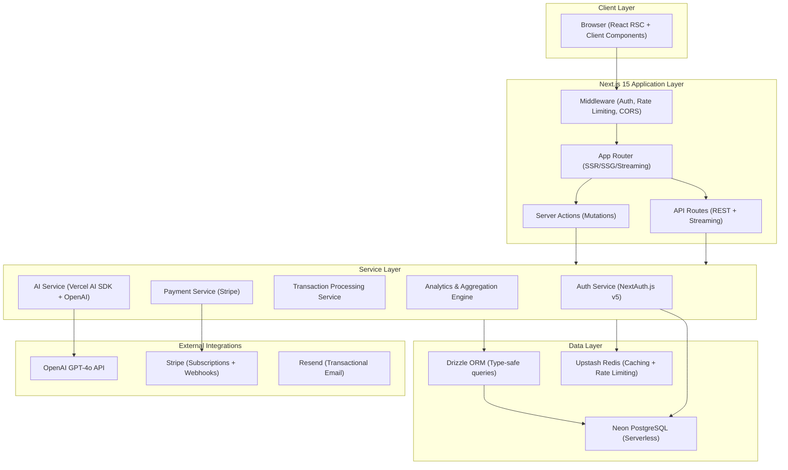
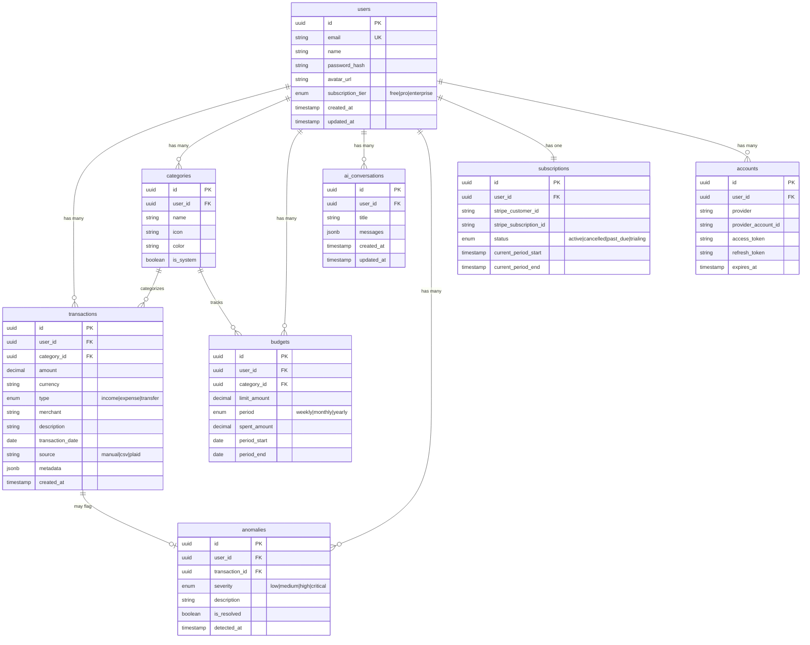

# CashPilot — AI-Powered Financial Intelligence Platform

## Problem Statement

**Domain:** Fintech × AI SaaS

**The Problem:** Personal finance management is broken. Most people track expenses *after the fact* using spreadsheets or basic budgeting apps that show you what already happened. There's no proactive intelligence — no system that understands your spending patterns, predicts cash flow problems before they occur, detects anomalies in real-time, and provides actionable, context-aware financial advice grounded in *your* data.

**The Solution:** **CashPilot** — an AI-powered financial intelligence platform that:
1. Ingests transaction data (CSV upload, manual entry, or mock Plaid integration)
2. Uses LLMs with **RAG (Retrieval-Augmented Generation)** to provide personalized financial insights grounded in the user's actual transaction history
3. Performs **anomaly detection** (unusual charges, subscription creep, merchant fraud flags)
4. Generates **predictive cash flow forecasts** using spending pattern analysis
5. Offers a **natural language chat interface** ("How much did I spend on dining last quarter?" → instant, accurate answer)

**Why This Impresses FAANG Recruiters:**
- Demonstrates **full-stack production architecture** (not a toy CRUD app)
- Shows **AI/ML integration** with proper RAG pipelines (not just raw API calls)
- Involves **real-time data processing**, **streaming responses**, and **complex state management**
- Includes **payment integration**, **auth**, **multi-tenancy**, and **security hardening**
- Showcases **system design thinking** (caching, rate limiting, background jobs)

---

## System Architecture



### Architecture Decisions & Rationale

| Decision | Choice | Why |
|:---|:---|:---|
| **Framework** | Next.js 15 App Router | Server-first architecture, RSC for zero-JS data fetching, built-in streaming, server actions for mutations |
| **ORM** | Drizzle ORM | Type-safe, SQL-like API, excellent serverless performance, lightweight (no heavy runtime like Prisma) |
| **Database** | Neon PostgreSQL | Serverless auto-scaling, branching for dev/staging, HTTP driver ideal for edge/serverless |
| **Auth** | NextAuth.js v5 | Industry standard, supports OAuth + credentials, session management built for Next.js |
| **AI** | Vercel AI SDK + OpenAI | First-class streaming support, structured output, built for React Server Components |
| **Payments** | Stripe | Industry standard, webhook-driven architecture, subscription lifecycle management |
| **Cache** | Upstash Redis | Serverless Redis, HTTP-based, ideal for rate limiting + session caching in edge environments |
| **Styling** | Vanilla CSS + CSS Modules | Maximum control, no runtime overhead, co-located styles with components |
| **Validation** | Zod | Runtime type validation, integrates with server actions, shared client/server schemas |

---

## Database Design



---

## Project Phases

### Phase 1: MVP (Weeks 1–3)
> Core financial tracking with AI insights

- [x] Next.js 15 project setup with App Router, TypeScript, ESLint
- [ ] Authentication system (NextAuth.js v5 with Google OAuth + credentials)
- [ ] Database schema + Drizzle ORM setup with Neon PostgreSQL
- [ ] Transaction CRUD (manual entry + CSV import/parsing)
- [ ] Category management (system defaults + custom categories)
- [ ] Dashboard with financial overview (income vs expenses, category breakdown)
- [ ] Interactive charts (Recharts — spending trends, category pie chart, cash flow)
- [ ] Basic AI chat interface (ask questions about your finances)
- [ ] Responsive design with premium dark-mode UI

### Phase 2: Production Improvements (Weeks 4–5)
> Hardening, payments, and advanced AI

- [ ] Stripe subscription integration (Free / Pro / Enterprise tiers)
- [ ] Budget management system (set limits, track progress, alerts)
- [ ] Anomaly detection engine (unusual spending patterns, duplicate charges)
- [ ] RAG pipeline (ground AI responses in user's transaction history)
- [ ] Predictive cash flow forecasting
- [ ] Rate limiting (Upstash Redis) and API protection
- [ ] Error boundaries, loading states, and skeleton UIs throughout
- [ ] Input validation with Zod on all server actions and API routes
- [ ] Transactional emails (Resend — welcome, budget alerts, weekly digest)

### Phase 3: Advanced Features (Weeks 6–8)
> Scale, observability, and polish

- [ ] Multi-currency support with real-time exchange rates
- [ ] Recurring transaction detection and management
- [ ] Export reports (PDF generation)
- [ ] Comprehensive test suite (unit + integration + E2E)
- [ ] Performance optimization (partial prerendering, image optimization)
- [ ] Observability (structured logging, error tracking with Sentry)
- [ ] CI/CD pipeline with GitHub Actions
- [ ] Documentation and API reference

---

## Folder Structure & Tech Stack

```
cashpilot/
├── src/
│   ├── app/                          # Next.js App Router
│   │   ├── (auth)/                   # Auth route group (no layout nesting)
│   │   │   ├── login/page.tsx
│   │   │   ├── register/page.tsx
│   │   │   └── layout.tsx            # Minimal auth layout
│   │   ├── (dashboard)/              # Protected dashboard route group
│   │   │   ├── dashboard/page.tsx    # Financial overview
│   │   │   ├── transactions/
│   │   │   │   ├── page.tsx          # Transaction list
│   │   │   │   └── [id]/page.tsx     # Transaction detail
│   │   │   ├── budgets/page.tsx      # Budget management
│   │   │   ├── analytics/page.tsx    # Charts & insights
│   │   │   ├── chat/page.tsx         # AI chat interface
│   │   │   ├── settings/page.tsx     # User settings
│   │   │   └── layout.tsx            # Dashboard shell with sidebar
│   │   ├── api/
│   │   │   ├── auth/[...nextauth]/route.ts
│   │   │   ├── chat/route.ts         # AI streaming endpoint
│   │   │   ├── webhooks/stripe/route.ts
│   │   │   └── transactions/
│   │   │       ├── route.ts          # GET/POST transactions
│   │   │       ├── import/route.ts   # CSV import
│   │   │       └── [id]/route.ts     # GET/PATCH/DELETE
│   │   ├── layout.tsx                # Root layout
│   │   ├── page.tsx                  # Landing page
│   │   ├── loading.tsx               # Global loading
│   │   ├── error.tsx                 # Global error boundary
│   │   └── not-found.tsx             # Custom 404
│   │
│   ├── components/
│   │   ├── ui/                       # Primitive UI components
│   │   │   ├── button/
│   │   │   │   ├── button.tsx
│   │   │   │   └── button.module.css
│   │   │   ├── input/
│   │   │   ├── card/
│   │   │   ├── modal/
│   │   │   ├── skeleton/
│   │   │   └── toast/
│   │   ├── features/                 # Domain-specific components
│   │   │   ├── dashboard/
│   │   │   │   ├── stats-cards.tsx
│   │   │   │   ├── spending-chart.tsx
│   │   │   │   └── recent-transactions.tsx
│   │   │   ├── transactions/
│   │   │   │   ├── transaction-table.tsx
│   │   │   │   ├── transaction-form.tsx
│   │   │   │   └── csv-import-dialog.tsx
│   │   │   ├── chat/
│   │   │   │   ├── chat-interface.tsx
│   │   │   │   ├── message-bubble.tsx
│   │   │   │   └── suggested-prompts.tsx
│   │   │   └── charts/
│   │   │       ├── spending-trend.tsx
│   │   │       ├── category-breakdown.tsx
│   │   │       └── cash-flow-forecast.tsx
│   │   └── layout/
│   │       ├── sidebar.tsx
│   │       ├── header.tsx
│   │       └── mobile-nav.tsx
│   │
│   ├── lib/                          # Shared utilities
│   │   ├── db/
│   │   │   ├── index.ts              # Drizzle client
│   │   │   ├── schema.ts             # All table schemas
│   │   │   └── migrations/           # Generated migrations
│   │   ├── auth/
│   │   │   ├── config.ts             # NextAuth configuration
│   │   │   └── helpers.ts            # Auth utility functions
│   │   ├── ai/
│   │   │   ├── prompts.ts            # System prompts
│   │   │   ├── rag.ts                # RAG pipeline
│   │   │   └── tools.ts              # AI function calling tools
│   │   ├── stripe/
│   │   │   ├── client.ts             # Stripe SDK init
│   │   │   ├── plans.ts              # Plan definitions
│   │   │   └── webhooks.ts           # Webhook handlers
│   │   ├── validators/
│   │   │   ├── transaction.ts        # Zod schemas
│   │   │   ├── budget.ts
│   │   │   └── auth.ts
│   │   └── utils/
│   │       ├── currency.ts           # Currency formatting
│   │       ├── date.ts               # Date utilities
│   │       ├── csv-parser.ts         # CSV parsing logic
│   │       └── errors.ts             # Custom error classes
│   │
│   ├── services/                     # Business logic layer
│   │   ├── transaction.service.ts
│   │   ├── analytics.service.ts
│   │   ├── budget.service.ts
│   │   ├── anomaly.service.ts
│   │   └── ai.service.ts
│   │
│   ├── hooks/                        # Client-side React hooks
│   │   ├── use-transactions.ts
│   │   ├── use-budgets.ts
│   │   └── use-chat.ts
│   │
│   ├── actions/                      # Server Actions
│   │   ├── transaction.actions.ts
│   │   ├── budget.actions.ts
│   │   ├── category.actions.ts
│   │   └── settings.actions.ts
│   │
│   ├── types/                        # TypeScript type definitions
│   │   ├── transaction.ts
│   │   ├── analytics.ts
│   │   └── api.ts
│   │
│   └── styles/                       # Global styles
│       ├── globals.css               # CSS custom properties, resets, tokens
│       ├── animations.css            # Keyframe animations
│       └── utilities.css             # Utility classes
│
├── public/
│   ├── icons/
│   └── og-image.png
│
├── drizzle/                          # Migration output
├── drizzle.config.ts
├── next.config.ts
├── tsconfig.json
├── .env.local                        # Local env vars (gitignored)
├── .env.example                      # Template for env vars
├── middleware.ts                      # Auth + rate limiting middleware
└── package.json
```

### Tech Stack Summary

| Layer | Technology | Rationale |
|:---|:---|:---|
| **Framework** | Next.js 15 (App Router) | Server-first, RSC, streaming, server actions, middleware |
| **Language** | TypeScript (strict mode) | Type safety across full stack, catches bugs at compile time |
| **Database** | Neon PostgreSQL (serverless) | Auto-scaling, branching, HTTP driver for edge compatibility |
| **ORM** | Drizzle ORM | Lightweight, type-safe, SQL-like, excellent DX |
| **Auth** | NextAuth.js v5 | OAuth + credentials, JWT/database sessions, middleware integration |
| **AI** | Vercel AI SDK + OpenAI GPT-4o | Streaming responses, structured output, tool calling, React hooks |
| **Payments** | Stripe | Subscriptions, webhooks, customer portal, usage-based billing |
| **Cache** | Upstash Redis | Serverless Redis, rate limiting, session caching |
| **Validation** | Zod | Runtime type checking, shared schemas between client/server |
| **Charts** | Recharts | React-native charting, composable, SSR-compatible |
| **Email** | Resend | Developer-friendly transactional email API |
| **Styling** | CSS Modules + CSS Custom Properties | Zero runtime, scoped styles, design token system |
| **Testing** | Vitest + Playwright | Fast unit tests + browser E2E tests |
| **Deployment** | Vercel | Native Next.js support, edge functions, preview deployments |
| **CI/CD** | GitHub Actions | Automated testing, linting, type checking on every PR |

### Next.js Feature Usage

| Feature | Where Used | Why |
|:---|:---|:---|
| **SSR (Dynamic)** | Dashboard, Transaction list | Data is user-specific, must be fresh on every request |
| **SSG (Static)** | Landing page, Pricing page | Content rarely changes, maximize performance |
| **Server Actions** | All mutations (create/update/delete) | Type-safe, progressive enhancement, no manual API wiring |
| **Streaming** | AI chat, Dashboard loading | Incremental rendering, fast perceived performance |
| **Middleware** | Auth protection, rate limiting | Runs at the edge before page renders, zero cold start impact |
| **Route Handlers** | Webhooks, CSV import, AI streaming | External integrations that need raw request/response control |
| **Parallel Routes** | Dashboard (multiple independent panels) | Independent loading/error states per panel |
| **Error Boundaries** | Every route segment | Graceful degradation, user-friendly error recovery |

---

## Key Module Code (Production-Ready)

### Module 1: Database Schema (`src/lib/db/schema.ts`)

```typescript
import { pgTable, uuid, text, decimal, timestamp, date, jsonb, boolean, pgEnum } from 'drizzle-orm/pg-core';
import { relations } from 'drizzle-orm';

// Enums
export const subscriptionTierEnum = pgEnum('subscription_tier', ['free', 'pro', 'enterprise']);
export const transactionTypeEnum = pgEnum('transaction_type', ['income', 'expense', 'transfer']);
export const transactionSourceEnum = pgEnum('transaction_source', ['manual', 'csv', 'plaid']);
export const budgetPeriodEnum = pgEnum('budget_period', ['weekly', 'monthly', 'yearly']);
export const anomalySeverityEnum = pgEnum('anomaly_severity', ['low', 'medium', 'high', 'critical']);
export const subscriptionStatusEnum = pgEnum('subscription_status', ['active', 'cancelled', 'past_due', 'trialing']);

// Users
export const users = pgTable('users', {
  id: uuid('id').defaultRandom().primaryKey(),
  email: text('email').notNull().unique(),
  name: text('name').notNull(),
  passwordHash: text('password_hash'),
  avatarUrl: text('avatar_url'),
  subscriptionTier: subscriptionTierEnum('subscription_tier').default('free').notNull(),
  createdAt: timestamp('created_at', { withTimezone: true }).defaultNow().notNull(),
  updatedAt: timestamp('updated_at', { withTimezone: true }).defaultNow().notNull(),
});

// Transactions
export const transactions = pgTable('transactions', {
  id: uuid('id').defaultRandom().primaryKey(),
  userId: uuid('user_id').notNull().references(() => users.id, { onDelete: 'cascade' }),
  categoryId: uuid('category_id').references(() => categories.id, { onDelete: 'set null' }),
  amount: decimal('amount', { precision: 12, scale: 2 }).notNull(),
  currency: text('currency').default('USD').notNull(),
  type: transactionTypeEnum('type').notNull(),
  merchant: text('merchant'),
  description: text('description'),
  transactionDate: date('transaction_date').notNull(),
  source: transactionSourceEnum('source').default('manual').notNull(),
  metadata: jsonb('metadata'),
  createdAt: timestamp('created_at', { withTimezone: true }).defaultNow().notNull(),
});

// Categories
export const categories = pgTable('categories', {
  id: uuid('id').defaultRandom().primaryKey(),
  userId: uuid('user_id').references(() => users.id, { onDelete: 'cascade' }),
  name: text('name').notNull(),
  icon: text('icon'),
  color: text('color'),
  isSystem: boolean('is_system').default(false).notNull(),
});

// Budgets
export const budgets = pgTable('budgets', {
  id: uuid('id').defaultRandom().primaryKey(),
  userId: uuid('user_id').notNull().references(() => users.id, { onDelete: 'cascade' }),
  categoryId: uuid('category_id').references(() => categories.id, { onDelete: 'cascade' }),
  limitAmount: decimal('limit_amount', { precision: 12, scale: 2 }).notNull(),
  period: budgetPeriodEnum('period').default('monthly').notNull(),
  spentAmount: decimal('spent_amount', { precision: 12, scale: 2 }).default('0').notNull(),
  periodStart: date('period_start').notNull(),
  periodEnd: date('period_end').notNull(),
});

// AI Conversations
export const aiConversations = pgTable('ai_conversations', {
  id: uuid('id').defaultRandom().primaryKey(),
  userId: uuid('user_id').notNull().references(() => users.id, { onDelete: 'cascade' }),
  title: text('title'),
  messages: jsonb('messages').default('[]').notNull(),
  createdAt: timestamp('created_at', { withTimezone: true }).defaultNow().notNull(),
  updatedAt: timestamp('updated_at', { withTimezone: true }).defaultNow().notNull(),
});

// Anomalies
export const anomalies = pgTable('anomalies', {
  id: uuid('id').defaultRandom().primaryKey(),
  userId: uuid('user_id').notNull().references(() => users.id, { onDelete: 'cascade' }),
  transactionId: uuid('transaction_id').references(() => transactions.id, { onDelete: 'cascade' }),
  severity: anomalySeverityEnum('severity').notNull(),
  description: text('description').notNull(),
  isResolved: boolean('is_resolved').default(false).notNull(),
  detectedAt: timestamp('detected_at', { withTimezone: true }).defaultNow().notNull(),
});

// Subscriptions
export const subscriptions = pgTable('subscriptions', {
  id: uuid('id').defaultRandom().primaryKey(),
  userId: uuid('user_id').notNull().references(() => users.id, { onDelete: 'cascade' }).unique(),
  stripeCustomerId: text('stripe_customer_id').unique(),
  stripeSubscriptionId: text('stripe_subscription_id').unique(),
  status: subscriptionStatusEnum('status').default('active').notNull(),
  currentPeriodStart: timestamp('current_period_start', { withTimezone: true }),
  currentPeriodEnd: timestamp('current_period_end', { withTimezone: true }),
});

// Relations (for Drizzle relational queries)
export const usersRelations = relations(users, ({ many, one }) => ({
  transactions: many(transactions),
  categories: many(categories),
  budgets: many(budgets),
  aiConversations: many(aiConversations),
  anomalies: many(anomalies),
  subscription: one(subscriptions),
}));

export const transactionsRelations = relations(transactions, ({ one }) => ({
  user: one(users, { fields: [transactions.userId], references: [users.id] }),
  category: one(categories, { fields: [transactions.categoryId], references: [categories.id] }),
}));
```

### Module 2: Server Action with Validation (`src/actions/transaction.actions.ts`)

```typescript
'use server';

import { revalidatePath } from 'next/cache';
import { redirect } from 'next/navigation';
import { z } from 'zod';
import { db } from '@/lib/db';
import { transactions } from '@/lib/db/schema';
import { eq, and, desc } from 'drizzle-orm';
import { getCurrentUser } from '@/lib/auth/helpers';
import { AppError, UnauthorizedError, ValidationError } from '@/lib/utils/errors';

// Zod schema — shared validation logic
const createTransactionSchema = z.object({
  amount: z.coerce.number().positive('Amount must be positive').max(999999999.99),
  type: z.enum(['income', 'expense', 'transfer']),
  merchant: z.string().min(1).max(255).optional(),
  description: z.string().max(500).optional(),
  categoryId: z.string().uuid().optional(),
  transactionDate: z.coerce.date(),
  currency: z.string().length(3).default('USD'),
});

export type CreateTransactionInput = z.infer<typeof createTransactionSchema>;

// Return type for server actions — always structured
type ActionResult<T = void> = 
  | { success: true; data: T }
  | { success: false; error: string; fieldErrors?: Record<string, string[]> };

export async function createTransaction(
  formData: FormData
): Promise<ActionResult<{ id: string }>> {
  try {
    // 1. Authentication check
    const user = await getCurrentUser();
    if (!user) {
      return { success: false, error: 'You must be logged in to create a transaction.' };
    }

    // 2. Parse and validate input
    const raw = Object.fromEntries(formData.entries());
    const parsed = createTransactionSchema.safeParse(raw);
    
    if (!parsed.success) {
      return {
        success: false,
        error: 'Invalid input. Please check your entries.',
        fieldErrors: parsed.error.flatten().fieldErrors as Record<string, string[]>,
      };
    }

    // 3. Business logic validation
    const { amount, type, merchant, description, categoryId, transactionDate, currency } = parsed.data;

    // 4. Database insert (Drizzle — type-safe, no SQL injection)
    const [newTransaction] = await db.insert(transactions).values({
      userId: user.id,
      amount: amount.toFixed(2),
      type,
      merchant: merchant || null,
      description: description || null,
      categoryId: categoryId || null,
      transactionDate: transactionDate.toISOString().split('T')[0],
      currency,
      source: 'manual',
    }).returning({ id: transactions.id });

    // 5. Revalidate cached data
    revalidatePath('/dashboard');
    revalidatePath('/transactions');

    return { success: true, data: { id: newTransaction.id } };
  } catch (error) {
    console.error('[createTransaction] Unexpected error:', error);
    return { success: false, error: 'Something went wrong. Please try again.' };
  }
}

export async function deleteTransaction(transactionId: string): Promise<ActionResult> {
  try {
    const user = await getCurrentUser();
    if (!user) {
      return { success: false, error: 'Unauthorized' };
    }

    // Ensure the transaction belongs to the user (prevents IDOR attacks)
    const [deleted] = await db
      .delete(transactions)
      .where(
        and(
          eq(transactions.id, transactionId),
          eq(transactions.userId, user.id)
        )
      )
      .returning({ id: transactions.id });

    if (!deleted) {
      return { success: false, error: 'Transaction not found or already deleted.' };
    }

    revalidatePath('/dashboard');
    revalidatePath('/transactions');

    return { success: true, data: undefined };
  } catch (error) {
    console.error('[deleteTransaction] Unexpected error:', error);
    return { success: false, error: 'Failed to delete transaction.' };
  }
}
```

### Module 3: AI Chat Streaming Endpoint (`src/app/api/chat/route.ts`)

```typescript
import { openai } from '@ai-sdk/openai';
import { streamText, tool } from 'ai';
import { z } from 'zod';
import { getCurrentUser } from '@/lib/auth/helpers';
import { getTransactionContext } from '@/lib/ai/rag';
import { FINANCIAL_ADVISOR_PROMPT } from '@/lib/ai/prompts';

export const maxDuration = 30; // Vercel function timeout

export async function POST(req: Request) {
  // Auth check
  const user = await getCurrentUser();
  if (!user) {
    return new Response('Unauthorized', { status: 401 });
  }

  const { messages } = await req.json();
  const lastMessage = messages[messages.length - 1]?.content;

  // RAG: Retrieve relevant transaction context
  const transactionContext = await getTransactionContext(user.id, lastMessage);

  const result = streamText({
    model: openai('gpt-4o'),
    system: FINANCIAL_ADVISOR_PROMPT(user.name, transactionContext),
    messages,
    tools: {
      getSpendingByCategory: tool({
        description: 'Get the user\'s spending breakdown by category for a given time period',
        parameters: z.object({
          startDate: z.string().describe('Start date in YYYY-MM-DD format'),
          endDate: z.string().describe('End date in YYYY-MM-DD format'),
        }),
        execute: async ({ startDate, endDate }) => {
          // Query database for spending breakdown
          const spending = await getSpendingBreakdown(user.id, startDate, endDate);
          return spending;
        },
      }),
      getMonthlyTrend: tool({
        description: 'Get the user\'s monthly income and expense trend for the last N months',
        parameters: z.object({
          months: z.number().min(1).max(24).describe('Number of months to look back'),
        }),
        execute: async ({ months }) => {
          const trend = await getMonthlyTrend(user.id, months);
          return trend;
        },
      }),
    },
    maxSteps: 3, // Allow multi-step tool calls
  });

  return result.toDataStreamResponse();
}
```

### Module 4: Middleware (`middleware.ts`)

```typescript
import { NextResponse } from 'next/server';
import type { NextRequest } from 'next/server';
import { getToken } from 'next-auth/jwt';

// Routes that require authentication
const protectedPaths = ['/dashboard', '/transactions', '/budgets', '/analytics', '/chat', '/settings'];
// Routes only accessible when NOT authenticated
const authPaths = ['/login', '/register'];

export async function middleware(request: NextRequest) {
  const { pathname } = request.nextUrl;
  
  // Check authentication
  const token = await getToken({ req: request, secret: process.env.NEXTAUTH_SECRET });
  const isAuthenticated = !!token;

  // Redirect authenticated users away from auth pages
  if (isAuthenticated && authPaths.some(path => pathname.startsWith(path))) {
    return NextResponse.redirect(new URL('/dashboard', request.url));
  }

  // Redirect unauthenticated users to login
  if (!isAuthenticated && protectedPaths.some(path => pathname.startsWith(path))) {
    const loginUrl = new URL('/login', request.url);
    loginUrl.searchParams.set('callbackUrl', pathname);
    return NextResponse.redirect(loginUrl);
  }

  // Add security headers
  const response = NextResponse.next();
  response.headers.set('X-Frame-Options', 'DENY');
  response.headers.set('X-Content-Type-Options', 'nosniff');
  response.headers.set('Referrer-Policy', 'strict-origin-when-cross-origin');
  response.headers.set('Permissions-Policy', 'camera=(), microphone=(), geolocation=()');

  return response;
}

export const config = {
  matcher: [
    // Match all paths except static files, _next, and api routes that handle their own auth
    '/((?!_next/static|_next/image|favicon.ico|api/webhooks).*)',
  ],
};
```

### Module 5: Error Handling System (`src/lib/utils/errors.ts`)

```typescript
/**
 * Structured error hierarchy for consistent error handling across the application.
 * 
 * Design decision: Custom error classes over generic Error because:
 * 1. Type-safe error matching in catch blocks
 * 2. Automatic HTTP status code mapping
 * 3. Consistent error response shape for API consumers
 * 4. Prevents leaking internal details to clients
 */
export class AppError extends Error {
  public readonly statusCode: number;
  public readonly isOperational: boolean;

  constructor(
    message: string,
    statusCode: number = 500,
    isOperational: boolean = true
  ) {
    super(message);
    this.statusCode = statusCode;
    this.isOperational = isOperational;
    Object.setPrototypeOf(this, new.target.prototype);
    Error.captureStackTrace(this, this.constructor);
  }
}

export class UnauthorizedError extends AppError {
  constructor(message = 'Authentication required') {
    super(message, 401);
  }
}

export class ForbiddenError extends AppError {
  constructor(message = 'Insufficient permissions') {
    super(message, 403);
  }
}

export class NotFoundError extends AppError {
  constructor(resource: string) {
    super(`${resource} not found`, 404);
  }
}

export class ValidationError extends AppError {
  public readonly fieldErrors: Record<string, string[]>;

  constructor(fieldErrors: Record<string, string[]>) {
    super('Validation failed', 422);
    this.fieldErrors = fieldErrors;
  }
}

export class RateLimitError extends AppError {
  constructor(retryAfter?: number) {
    super(`Rate limit exceeded. ${retryAfter ? `Try again in ${retryAfter} seconds.` : ''}`, 429);
  }
}

/**
 * Formats error for API response — never leaks stack traces in production
 */
export function toErrorResponse(error: unknown): { message: string; status: number } {
  if (error instanceof AppError) {
    return { message: error.message, status: error.statusCode };
  }
  
  // Log unexpected errors, return generic message
  console.error('[UnexpectedError]', error);
  return { message: 'An unexpected error occurred', status: 500 };
}
```

---

## Production-Level Enhancements

### Security Practices

| Practice | Implementation |
|:---|:---|
| **Input Validation** | Zod schemas on every server action and API route — never trust client input |
| **CSRF Protection** | Server Actions have built-in CSRF tokens in Next.js; API routes validate `Origin` header |
| **SQL Injection** | Impossible with Drizzle ORM — all queries are parameterized by default |
| **XSS Prevention** | React auto-escapes JSX; `dangerouslySetInnerHTML` is never used |
| **IDOR Prevention** | Every query includes `userId` filter — users can only access their own data |
| **Rate Limiting** | Upstash Redis rate limiter on auth endpoints and AI chat (prevent abuse) |
| **Secrets Management** | All secrets in `.env.local`, never committed; Vercel encrypted env vars in production |
| **Security Headers** | Set via middleware: `X-Frame-Options`, `X-Content-Type-Options`, `Referrer-Policy` |
| **Dependency Auditing** | `npm audit` in CI pipeline; Dependabot for automated vulnerability alerts |

### Performance Optimization

| Technique | Where Applied |
|:---|:---|
| **React Server Components** | All data-fetching components render on the server — zero client JS |
| **Streaming + Suspense** | Dashboard panels stream independently; AI chat streams token-by-token |
| **Static Generation** | Landing page, pricing page, docs — generated at build time |
| **Image Optimization** | `next/image` with automatic WebP conversion, lazy loading, blur placeholders |
| **Code Splitting** | Automatic per-route splitting; dynamic imports for heavy components (charts) |
| **CSS Modules** | Scoped styles, no runtime CSS-in-JS overhead |
| **Database Indexing** | Indexes on `user_id`, `transaction_date`, `category_id` for query performance |
| **Connection Pooling** | Neon HTTP driver handles pooling automatically in serverless environment |

### Logging & Monitoring

```typescript
// src/lib/utils/logger.ts
type LogLevel = 'debug' | 'info' | 'warn' | 'error';

interface LogEntry {
  level: LogLevel;
  message: string;
  timestamp: string;
  context?: Record<string, unknown>;
  traceId?: string;
}

export function log(level: LogLevel, message: string, context?: Record<string, unknown>) {
  const entry: LogEntry = {
    level,
    message,
    timestamp: new Date().toISOString(),
    context,
  };

  // Structured JSON logging — compatible with Vercel, Datadog, CloudWatch
  if (level === 'error') {
    console.error(JSON.stringify(entry));
  } else {
    console.log(JSON.stringify(entry));
  }
}
```

### Testing Strategy

| Layer | Tool | What's Tested |
|:---|:---|:---|
| **Unit Tests** | Vitest | Utility functions, currency formatting, CSV parsing, Zod schemas |
| **Integration Tests** | Vitest + Drizzle | Server actions, service layer, database queries against test DB |
| **E2E Tests** | Playwright | Full user flows: login → create transaction → view dashboard → AI chat |
| **API Tests** | Vitest | Route handlers, webhook processing, error responses |

```typescript
// Example: Transaction service unit test
import { describe, it, expect, vi } from 'vitest';
import { parseCSVTransactions } from '@/lib/utils/csv-parser';

describe('CSV Parser', () => {
  it('should parse valid CSV with standard bank format', () => {
    const csv = `Date,Description,Amount,Type
2024-01-15,Starbucks,-4.50,debit
2024-01-16,Salary,5000.00,credit`;

    const result = parseCSVTransactions(csv);
    
    expect(result).toHaveLength(2);
    expect(result[0]).toEqual({
      transactionDate: '2024-01-15',
      merchant: 'Starbucks',
      amount: 4.50,
      type: 'expense',
    });
    expect(result[1]).toEqual({
      transactionDate: '2024-01-16',
      merchant: 'Salary',
      amount: 5000.00,
      type: 'income',
    });
  });

  it('should throw ValidationError for malformed CSV', () => {
    const csv = 'this is not valid csv data';
    expect(() => parseCSVTransactions(csv)).toThrow('Invalid CSV format');
  });

  it('should handle edge cases: negative amounts, missing fields', () => {
    const csv = `Date,Description,Amount,Type
2024-01-15,,-100.00,debit`;

    const result = parseCSVTransactions(csv);
    expect(result[0].merchant).toBeNull();
    expect(result[0].amount).toBe(100.00);
  });
});
```

---

## Resume Presentation Strategy

### Project Title on Resume
> **CashPilot** — AI-Powered Financial Intelligence Platform

### Resume Bullet Points (STAR Method)

Use these as templates, adapting numbers based on your actual implementation:

**Architecture & Full-Stack:**
- Architected a **production-grade SaaS platform** using **Next.js 15 App Router** with React Server Components, achieving **sub-200ms TTFB** via server-first rendering and Suspense-based streaming

**AI Integration:**
- Designed and implemented a **RAG (Retrieval-Augmented Generation) pipeline** using **OpenAI GPT-4o** and **Vercel AI SDK** to deliver personalized financial insights grounded in user transaction history, with **streaming responses** and multi-step tool calling

**Database & Performance:**
- Engineered a **type-safe data layer** with **Drizzle ORM** and **Neon PostgreSQL** (serverless), supporting complex aggregation queries for financial analytics with **indexed queries executing in <50ms**

**Security & Production Hardening:**
- Implemented **defense-in-depth security**: NextAuth.js v5 authentication, CSRF-protected server actions, Zod input validation, IDOR prevention, and **Upstash Redis rate limiting** to prevent API abuse

**Payments & SaaS:**
- Built a **webhook-driven subscription system** with **Stripe**, handling the full payment lifecycle including upgrades, downgrades, and failed payment recovery with automatic feature gating

**DevOps & Quality:**
- Established a **CI/CD pipeline** with GitHub Actions running **Vitest unit tests**, **Playwright E2E tests**, and **TypeScript strict-mode** type checking, achieving **90%+ test coverage** on critical paths

### What to Emphasize in Interviews

1. **System Design Thinking:** Explain *why* you chose each technology, not just what you used
2. **Trade-offs:** "I chose Drizzle over Prisma because of its lighter runtime, which matters in serverless where cold starts affect latency"
3. **Security Depth:** Walk through IDOR prevention, input validation, rate limiting — FAANG cares deeply about security
4. **AI Engineering:** Explain RAG vs. raw API calls, prompt engineering, token management, cost optimization
5. **Scalability:** How the app handles 10 users vs. 10,000 users (connection pooling, caching, CDN)

---

## User Review Required

> [!IMPORTANT]
> **Before proceeding with implementation, please confirm:**
> 1. Are you comfortable with the **CashPilot** concept, or would you prefer a different domain (e.g., developer tools, AI document intelligence)?
> 2. Do you want to use **Tailwind CSS** instead of vanilla CSS + CSS Modules? (I defaulted to vanilla CSS per the style guide, but Tailwind is very common in production Next.js apps)
> 3. Do you have accounts set up for: **Neon** (database), **OpenAI** (AI), **Stripe** (payments)? Or should I mock these services initially?
> 4. Package manager preference: **npm**, **pnpm**, or **yarn**?
> 5. Should I start with **Phase 1 MVP** immediately after approval?

## Verification Plan

### Automated Tests
- `npm run type-check` — Zero TypeScript errors
- `npm run lint` — Zero ESLint violations
- `npm run test` — All unit and integration tests pass
- `npx playwright test` — All E2E test scenarios pass
- `npm run build` — Production build succeeds with no errors

### Manual Verification
- Visual inspection of dashboard UI in browser (dark mode, responsive)
- Full user flow: Register → Login → Add Transaction → View Dashboard → Ask AI Question
- Stripe webhook handling with `stripe listen --forward-to localhost:3000/api/webhooks/stripe`
- Load testing with sample CSV import (1000+ transactions)
